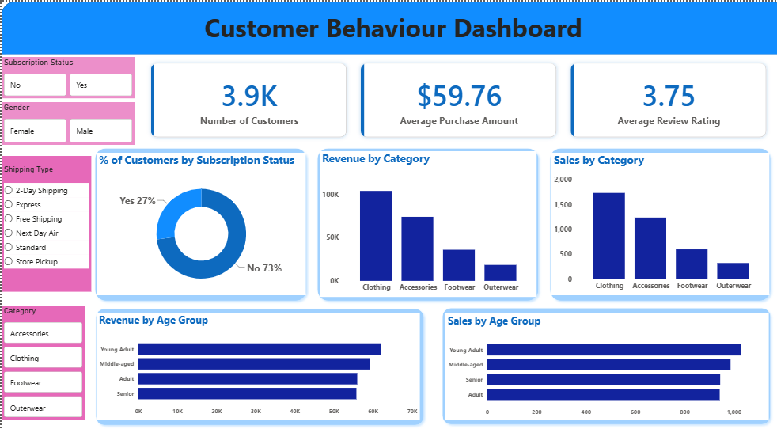

# Customer Shopping Behavior Analysis

End-to-end data analytics project using Python, PostgreSQL, SQL and Power BI to analyze customer purchasing behavior and generate business insights.

## Overview
This project analyzes **3,900 purchase records across 18 attributes** to understand customer purchasing behavior, spending patterns, product preferences, discount usage, subscription behavior and demographic trends.

The project follows an end-to-end analytics workflow:

**Data Exploration → Data Cleaning & Feature Engineering → PostgreSQL Analysis → Power BI Dashboard → Business Insights & Recommendations**

The objective was to transform raw customer transaction data into structured analysis and actionable insights related to customer loyalty, subscription adoption, discount strategy, product performance and targeted marketing.

## Dataset
The dataset contains **3,900 records and 18 attributes** covering customer demographics, purchase details, shopping behavior, customer feedback and shipping information.

### Key Attributes
- **Customer demographics:** Age, Gender, Location, Subscription Status
- **Purchase details:** Item Purchased, Category, Purchase Amount, Season, Size, Color
- **Shopping behavior:** Discount Applied, Promo Code Used, Previous Purchases, Frequency of Purchases
- **Customer feedback:** Review Rating
- **Fulfillment:** Shipping Type

The dataset contained **37 missing values in Review Rating**, which were addressed during data preparation.

## Tools & Technologies
| Tool | Application |
|---|---|
| **Python** | Data exploration, cleaning and feature engineering |
| **Pandas** | Data manipulation and transformation |
| **Jupyter Notebook** | Python-based analysis |
| **PostgreSQL** | Database integration and SQL analysis |
| **SQL** | Business question analysis and customer segmentation |
| **Power BI** | Interactive dashboard and data visualization |
| **PowerPoint** | Business presentation |

## Analytical Workflow
### 1. Data Exploration — Python

The dataset was loaded using Pandas and examined for structure, data types, distributions, missing values and data quality issues.
The initial exploration included:
- Dataset structure and dimensionality checks
- Descriptive statistics
- Missing value analysis
- Category and value distribution checks
- Customer demographic analysis
- Purchase behavior analysis
- Review rating analysis

### 2. Data Cleaning & Feature Engineering — Python

The dataset was cleaned and transformed to prepare it for PostgreSQL analysis and dashboard development.

Key transformations included:

- Identified **37 missing Review Rating values** and imputed them using the **median rating within each product category**.
- Renamed the dataset columns to consistent **snake_case** naming conventions for easier use across Python and PostgreSQL.
- Converted categorical purchase frequency values into a numerical `purchase_frequency_days` field, mapping frequencies such as Weekly and Fortnightly to corresponding day values.
- Created an `age_group` feature using Pandas `qcut` to divide customers into four age segments: **Young Adult, Adult, Middle-aged and Senior**.
- Compared `discount_applied` and `promo_code_used` to validate their relationship and removed the redundant `promo_code_used` field from the final analysis dataset.
- Prepared the cleaned DataFrame for PostgreSQL integration.

### 3. PostgreSQL & SQL Analysis

The prepared dataset was loaded into PostgreSQL to perform structured, business-focused analysis.

SQL queries were developed to answer **10 key business questions**:

1. **Revenue by Gender**  
   Compared total revenue generated by male and female customers.

2. **High-Spending Discount Users**  
   Identified purchase records where discounts were applied and the purchase amount was at or above the overall average.

3. **Top-Rated Products**  
   Identified the five products with the highest average review ratings.

4. **Shipping Type Comparison**  
   Compared average purchase amounts between Standard and Express shipping.

5. **Subscribers vs. Non-Subscribers**  
   Compared record count, average spending and total revenue across subscription groups.

6. **Discount-Dependent Products**  
   Identified the five products with the highest proportion of purchases made with discounts.

7. **Customer Segmentation**  
   Classified records into New, Returning and Loyal segments based on previous purchase history:
   - **New:** 1 previous purchase
   - **Returning:** 2–10 previous purchases
   - **Loyal:** More than 10 previous purchases

8. **Top 3 Products by Category**  
   Identified the three most purchased products within each category using SQL window functions.

9. **Repeat Buyers & Subscription Behavior**  
   Examined subscription status among records with more than five previous purchases.

10. **Revenue by Age Group**  
    Compared revenue contribution across age groups.

## Key Findings

### Revenue by Gender

Male customers generated **US$157,890** in total revenue compared with **US$75,191** generated by female customers.

### High-Spending Discount Users

**839 purchase records** involved a discount while the purchase amount was at or above the overall average purchase amount, highlighting a significant group of higher-value purchases associated with promotional offers.

### Top-Rated Products

| Product | Average Rating |
|---|---:|
| Gloves | 3.86 |
| Sandals | 3.84 |
| Boots | 3.82 |
| Hat | 3.80 |
| Skirt | 3.78 |

### Shipping Behavior

Customers using Express shipping recorded an average purchase amount of **US$60.48**, compared with **US$58.46** for Standard shipping.

### Subscription Analysis

| Customer Type | Records | Average Spend | Total Revenue |
|---|---:|---:|---:|
| Subscribers | 1,053 | US$59.49 | US$62,645 |
| Non-Subscribers | 2,847 | US$59.87 | US$170,436 |

Average spending was broadly similar between subscribers and non-subscribers. However, non-subscribers generated substantially higher total revenue because of their larger number of records.

### Discount-Dependent Products

The products with the highest percentage of discounted purchases were:

| Product | Discount Rate |
|---|---:|
| Hat | 50.00% |
| Sneakers | 49.66% |
| Coat | 49.07% |
| Sweater | 48.17% |
| Pants | 47.37% |

### Customer Segmentation

Based on previous purchase history, records were classified into New, Returning and Loyal segments:

| Segment | Records |
|---|---:|
| Loyal | 3,116 |
| Returning | 701 |
| New | 83 |

The Loyal segment represents the largest share of the analyzed records.

### Repeat Buyers & Subscription Behavior

Among records with more than five previous purchases:

- **2,518 were associated with non-subscribers**
- **958 were associated with subscribers**

This indicates an opportunity to improve subscription conversion among frequent repeat buyers.

### Revenue by Age Group

| Age Group | Revenue |
|---|---:|
| Young Adult | US$62,143 |
| Middle-aged | US$59,197 |
| Adult | US$55,978 |
| Senior | US$55,763 |

Young Adults generated the highest revenue contribution among the analyzed age groups.

## Power BI Dashboard

An interactive Power BI dashboard was developed to communicate the analysis through key performance indicators, category comparisons, customer segmentation, subscription analysis and demographic trends.

### Dashboard Coverage

- Total customer count
- Average purchase amount
- Average review rating
- Revenue and sales by category
- Revenue by age group
- Subscription analysis
- Customer segmentation
- Customer purchasing behavior
- Interactive filters across customer and transaction attributes

### Dashboard Preview

## Business Recommendations

Based on the analysis, the following opportunities were identified:

### Increase Subscription Adoption

Target frequent non-subscribers with stronger subscription benefits, exclusive offers and targeted incentives to improve conversion among customers who already demonstrate repeat purchasing behavior.

### Strengthen Customer Loyalty

Develop targeted loyalty initiatives for Returning customers while maintaining engagement with the existing Loyal segment.

### Optimize Discount Strategy

Review products with a high proportion of discounted purchases to evaluate promotional effectiveness and balance sales growth with margin considerations.
### Leverage Product Performance
Highlight highly rated and frequently purchased products in promotional campaigns and product positioning strategies.
### Target High-Value Customer Groups
Use demographic and purchasing patterns to develop more targeted marketing campaigns across high-revenue customer groups.

### Evaluate Shipping Preferences
Customers selecting Express shipping showed a slightly higher average purchase amount. This behavior can be considered when evaluating premium service offerings and customer experience strategies.

## Conclusion
This project demonstrates an end-to-end approach to customer analytics, combining Python-based data preparation, PostgreSQL and SQL analysis, and Power BI visualization.
The analysis translated customer transaction data into measurable insights around spending behavior, customer segmentation, subscription adoption, discount usage and product performance, supporting data-driven recommendations for customer engagement and retention.

